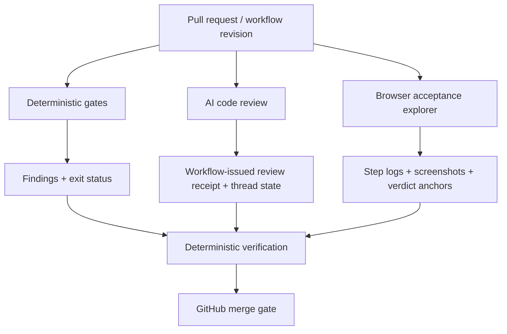
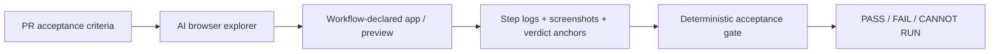
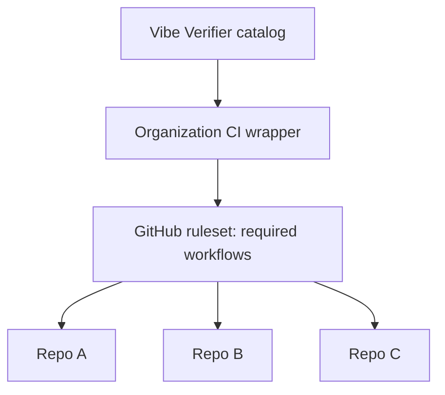

# Vibe Verifier

**Verification infrastructure for AI-generated pull requests.**

Agents and tools produce evidence. Deterministic gates decide whether that evidence satisfies the configured merge checks.

Vibe Verifier combines diff-aware repository gates, revision-bound AI code review, browser-driven acceptance verification, multi-repository governance, and read-only CI observability. Model output is evidence, never authority: workflows and deterministic gates own the final pass/fail signal.

## Verification model



The important boundary is between **producing evidence** and **deciding whether that evidence is sufficient**. AI can inspect code and exercise a running application, but it does not directly issue the merge verdict.

See [Architecture](docs/architecture.md) and [Threat model](docs/threat-model.md).

## What it establishes

| Layer | What it verifies |
|---|---|
| **Deterministic gates** | Structural, security, workflow, test-presence, test-strength, and complexity invariants, and the repository's own declared code patterns, on the pull request diff |
| **Revision-bound AI review** | A receipt matches the event head commit and the supplied unresolved-thread count is zero |
| **Acceptance verification** | Each criterion has a PASS with a resolving anchor; recorded browser artifacts satisfy structural checks for the workflow-declared application |
| **Governance** | Base-manifest arguments resist self-weakening; organization wrappers can protect the required workflow itself |
| **Observability** | Current PR checks, bot activity, runner capacity, and optional numeric model usage are visible without exposing dashboard write controls |

### Trust properties

Vibe Verifier is designed for repositories where the thing writing code may also be capable of editing tests, workflows, review instructions, and configuration.

| Failure mode | Vibe Verifier behavior |
|---|---|
| AI review fails or the provider is unavailable | No new receipt is issued; the review job fails |
| The reviewer's subscription is rate-limited | A second account (`CLAUDE_CODE_OAUTH_TOKEN_FALLBACK`) reviews instead; when every configured account is limited, the job passes with a warning and posts a `limited` receipt for that head only; the next real review covers what it let through |
| A new commit is pushed after review | The previous receipt is stale; the new head must be verified |
| A PR removes a gate, adds `--soak`, or raises its threshold | The current PR is still judged using the base branch's version of that gate |
| A gate cannot determine a verdict | Exit `2`; never reported as a clean pass |
| Browser QAE claims a criterion passed without evidence | The deterministic verifier rejects missing or unresolved evidence anchors |
| The explorer tries to choose which deployed site was judged | The workflow declares the URL used to scope request checks; direct-consumer workflows still need protection |
| A new gate needs observation before enforcement | `--soak` reports violations without blocking, but still fails if the gate itself cannot run |

The full rules are in the [gate contract](docs/GATE-CONTRACT.md).

## Capabilities

| Capability | Included |
|---|:---:|
| Diff-aware local and CI gates | ✓ |
| Fail-closed `pass / violation / cannot-run` contract | ✓ |
| Base-controlled verification policy | ✓ |
| Observe-before-enforce rollout | ✓ |
| AI pull-request review | ✓ |
| Exact-head review receipts | ✓ |
| Unresolved review threads can block | ✓ |
| Browser-driven acceptance exploration | ✓ |
| Screenshot and step-log evidence | ✓ |
| Deterministic validation of AI-produced evidence | ✓ |
| Organization wrapper workflows | ✓ |
| Ruleset-based cross-repository enforcement | ✓ |
| Commit-SHA pin inventory and propagation | ✓ |
| Local read-only verification dashboard | ✓ |
| Numeric model-usage and runner-capacity telemetry | Optional |

## Get started

The deterministic gates need Git and Python 3. Some gates download tools on first use; automatic downloads support macOS (Intel or Apple silicon) and Linux x86-64. The complexity and mutation gates use Node.js 24 and npm for JavaScript and TypeScript files, and Python 3 with `venv` and `pip` for Python files; the mutation gate also runs the project's own Vitest or pytest, so install the project's dependencies before it.

### 1. Declare the verification policy

Create `.vibe-verifier` at the root of the project, one gate per line:

```text
gitleaks
no-duplicate-package-json-keys
new-source-has-test
max-file-lines --max 500
```

Each line is both a subscription and that gate's configuration. Add `--soak` while introducing a gate if you want findings reported before they block merging.

### 2. Run it locally

Check out and commit the branch you want to verify. The gates use Git history, so uncommitted edits are not fully checked and the branch you plan to merge into must be available locally.

Clone Vibe Verifier separately and run it against the project:

```bash
git clone https://github.com/Greenbauer/vibe-verifier.git
cd vibe-verifier
bin/vibe-verifier run \
  --repo "/path/to/your/project" \
  --manifest "/path/to/your/project/.vibe-verifier" \
  --base-ref main
```

Results distinguish gates that **passed**, **found violations**, and **could not run**. A run that verified nothing does not look like a pass.

### 3. Make it a GitHub merge gate

Copy [`consumer/vibe-verifier.yml`](consumer/vibe-verifier.yml) to the consumer repository as `.github/workflows/vibe-verifier.yml`. Replace the all-zero placeholder on its last line with the full commit SHA from `git rev-parse HEAD` in the Vibe Verifier clone.

Commit the workflow and `.vibe-verifier` together, then make `vibe-verifier-ok` a required check when it should block merging.

For organization-level enforcement without a mutable workflow in each consumer repository, use [wrapper workflows](docs/GATE-CONTRACT.md#wrappers).

## Deterministic verification gates

Each gate is a command-line program that reads a working tree and its Git history. Pure gates need no secrets, network, or service account, so the same gate can run on a laptop, in a pre-push hook, or on a CI runner.

| Gate | What it catches |
|---|---|
| `gitleaks` | Secrets added in a pull request's commits |
| `new-source-has-test` | New source files without a matching test filename or an import from a test (Python: also a test that runs the script by name) |
| `changed-code-mutation` | Changed lines the project's own tests do not notice being broken: [StrykerJS](https://stryker-mutator.io/) (JS, TS) or [mutmut](https://github.com/boxed/mutmut) (Python) mutates only the lines a pull request added or modified, and the gate fails below a mutation score |
| `actionlint` | Errors in changed GitHub Actions workflows |
| `zizmor` | Security risks in changed workflows, such as unpinned actions and excessive permissions |
| `cognitive-complexity` | New files with functions over the complexity limit, or changed files with more of them |
| `max-file-lines` | New files over the line limit, or existing files over it that grew |
| `repo-rules` | New findings of the repository's own [ast-grep](https://ast-grep.github.io/) rules and of catalog [rule packs](rules/README.md), each with a message saying what to write instead |
| `no-duplicate-package-json-keys` | Duplicate keys or invalid JSON in `package.json` |
| `build-tools-in-devdependencies` | Known development packages listed as runtime dependencies |
| `branch-name-length` | Branch names longer than the configured limit |

`repo-rules` is how a repository writes its established patterns down as executable rules instead of prose: add `.vibe-verifier-rules/` with a rule and its test, then subscribe with a `repo-rules` line ([setup](docs/GATE-CONTRACT.md#repository-rules)). The prose follows the rules, not the other way round: `bin/vibe-verifier rules-doc` writes a generated block listing every rule with its message into a file such as `AGENTS.md`, and `repo-rules --doc AGENTS.md` fails a pull request whose block no longer matches the rule files. Two [agent skills](skills/README.md) for Claude Code and Cursor build on it: `follow-repo-rules` (read the block, run the gates before pushing, fix findings the way each message says) and `encode-a-lesson` (turn a mistake that happened twice into a type, a rule, a helper or a runtime check).

`new-source-has-test`, `cognitive-complexity`, `max-file-lines` and `changed-code-mutation` cover JavaScript, TypeScript and Python by default. `new-source-has-test` looks for a matching test filename or an import; it does not run tests or measure coverage, so a test that copies the code it covers or asserts nothing satisfies it. `changed-code-mutation` runs the tests: it changes the changed lines one small edit at a time and reports each edit no test failed on. It runs the project's own Vitest 2.x to 4.x or pytest, needs the project's dependencies installed first, and does not see CSS, behavior only an end-to-end test reaches, or edits no test could tell apart from the original ([limits](docs/GATE-CONTRACT.md#changed-code-mutation)). Keep the project's existing build, test, lint, and security suites.

See the [gate contract](docs/GATE-CONTRACT.md) for options, comparison branches, exit codes, GitHub setup, wired-gate inputs, and extension rules.

## Agent verification harnesses

### Revision-bound AI review

The [review harness](harnesses/review/README.md) asks a model to review a pull request against the consumer repository's own rules, but the model does not create the trusted success signal.

The workflow:

1. pins review instructions to the base branch,
2. scopes the review to the current pull-request revision,
3. runs the reviewer with read/comment tools,
4. issues a workflow-owned receipt only after the review completes, and
5. lets a deterministic gate verify that the receipt matches the current head and that required threads are resolved.

A push after review makes the old receipt stale. The harness selects a full review, delta review, or no-change receipt refresh from the changed files. A provider failure, model error, or interrupted review issues no new receipt and fails the review job. When the first account does not complete a review, a second account (`CLAUDE_CODE_OAUTH_TOKEN_FALLBACK`, optional) runs it. The one exception is a proven rate or usage limit on every configured account: the job passes with a warning and posts a `limited` receipt, which counts for that exact head but is never used as the starting point for the next review.

### Browser acceptance verification

The [QAE harness](harnesses/qae/README.md) turns pull-request acceptance criteria into browser evidence against a running application.



The explorer can navigate and observe. The verifier independently checks that every criterion has a PASS with at least one resolving evidence anchor in the working tree or run artifacts. It checks screenshots for recorded steps, a navigation and network record, and recorded console/request failures outside configured exceptions, including a criterion's declared expected 401/403 refusal. These checks establish evidence shape, not whether the observations prove the criterion's meaning.

Review receipts explicitly name a head SHA. QAE instead uses the pull-request workflow checkout and artifacts from the same run; its verdict comment is selected by bot identity, without a SHA/run-ID match. The consumer must supply the intended application revision, and configure the required checks to include explorer failures. See the [revision-binding limits](docs/threat-model.md#revision-binding-limits).

The review harness and default Claude explorer need Claude authentication. A Codex explorer lane can use a self-hosted runner holding a ChatGPT login; browser testing also needs an application it can start or reach. The regular gates need no AI account. CI and model usage may incur charges under the selected providers' plans.

## Organization governance

For multiple repositories, Vibe Verifier can move the verification policy out of individual consumer pull requests.

A wrapper repository can carry the required workflows and each repository's gate list. GitHub organization rulesets then require those pinned workflows on target repositories. A consumer pull request does not contain the workflow or policy that judges it.



`bin/vibe-verifier consumers` inventories policy, workflow drift, action pins, and selected native GitHub enforcement. `bin/vibe-verifier apply-down` plans pin updates and prints a digest. Confirming that plan opens pin-update pull requests; with `--wrapper`, it can also update organization ruleset pins directly once the wrapper changes are on its default branch. It never merges the update pull requests.

See [Wrappers](docs/GATE-CONTRACT.md#wrappers) for the complete model and limitations.

## Verification observability

The optional [local CI dashboard](docs/dashboard.md) gives a read-only view of selected repositories:

- current pull requests and exact-head check state,
- configured reviewer, explorer, and verifier activity,
- workflow/job history and current elapsed time,
- optional runner-capacity telemetry,
- optional numeric model usage and quota windows.

It binds to loopback, can optionally sit behind a trusted private HTTPS proxy, accepts `GET` only, has no merge/retry/cancel/publish controls, and does not change the gate runner. Missing telemetry stays unavailable rather than becoming zero; stale and partial samples retain explicit status and timestamps.

## Built from real CI failures

The verification contracts have been tightened in response to failures observed in live consumers, including:

- an 87-file pull request that exceeded a fixed AI-review turn cap, leading to scope-sized caps while retaining failure when the cap is reached ([`028a691`](https://github.com/Greenbauer/vibe-verifier/commit/028a691c528475d1b86dd279cbd567a01df079e1)),
- pull requests with more than 100 comments exposing receipt/verdict pagination errors ([`3d1eab1`](https://github.com/Greenbauer/vibe-verifier/commit/3d1eab1f568168aa126abcb7d47361d7b47da624)),
- a self-hosted QAE runner without passwordless `sudo` exposing Playwright installation assumptions ([`cf27b2b`](https://github.com/Greenbauer/vibe-verifier/commit/cf27b2b73636cae7cb1f50389992fd422e2eb4db)), and
- protected Vercel previews requiring a cookie-based browser path that does not put the bypass secret in the preview URL ([`70c559e`](https://github.com/Greenbauer/vibe-verifier/commit/70c559ee5372e577aa128edd689904cd27b28ba6)).

These cases are part of the design history because a verification system should fail visibly when it cannot establish a trustworthy verdict.

## Keep consumers current

Run `git fetch origin` in the Vibe Verifier clone before checking for updates.

For multiple projects, see [subscribing in CI](docs/GATE-CONTRACT.md#subscribing-in-ci). Each consumer owns its `runs-on:` choice; inventory and pin propagation treat runner selection as consumer configuration rather than catalog drift.

## Architecture and security

- [Architecture](docs/architecture.md): system layers, trust boundaries, evidence flow, and invariants.
- [Threat model](docs/threat-model.md): untrusted inputs, mitigations, and residual risks.
- [Gate contract](docs/GATE-CONTRACT.md): gate interface, manifests, base-policy behavior, CI subscription, wrappers, and extension rules.
- [Review harness](harnesses/review/README.md): revision-bound AI review and workflow receipts.
- [QAE harness](harnesses/qae/README.md): browser exploration, artifacts, and deterministic acceptance verdicts.
- [Dashboard](docs/dashboard.md): local read-only verification observability, and the [Linux host runbook](docs/dashboard-host.md) that runs it under systemd.
- [Security policy](SECURITY.md): vulnerability reporting and supported versions.

## Contribute

Read [how to add a gate](docs/GATE-CONTRACT.md#adding-a-gate) and run the test suite:

```bash
python3 -m unittest discover -s tests
```

For vulnerability reports, follow [SECURITY.md](SECURITY.md).

## License

[Apache-2.0](LICENSE).
