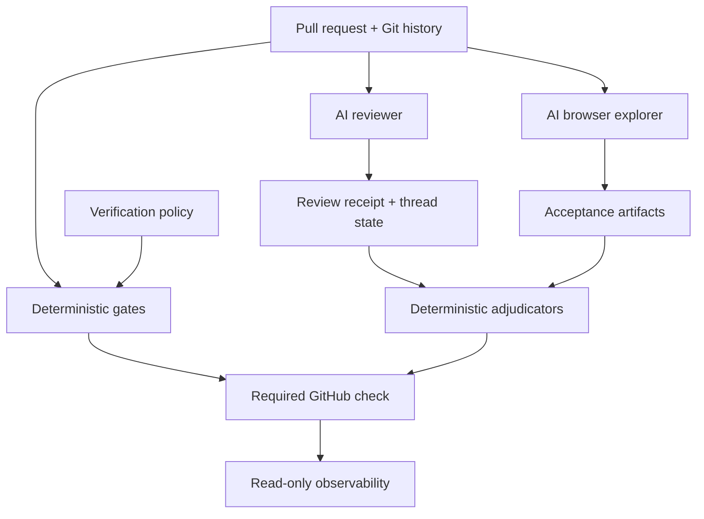

# Architecture

Vibe Verifier is a verification layer for pull requests, especially repositories where humans and software agents both author changes.

Its central design rule is simple:

> Evidence producers may be probabilistic. Merge adjudication is deterministic.

A linter, static analyzer, reviewer model, browser explorer, or external workflow can produce evidence. A gate decides whether that evidence satisfies an explicit contract for the current revision.

## System invariants

The architecture is organized around seven invariants:

1. **Verification runs have revision context.** Review receipts explicitly name a head SHA. QAE uses the workflow checkout and same-run artifacts; its comment and deployed application have the [binding limits](threat-model.md#revision-binding-limits) described below.
2. **Cannot verify is not pass.** A gate that cannot establish a verdict returns exit `2` and fails the aggregate run.
3. **The subject cannot silently weaken its own judge.** When a consumer manifest exists on the base branch, the current pull request is judged using the union of base and head subscriptions, with the base branch's arguments winning for gates present on both sides. The same holds for a repository's own `repo-rules` rule files: a rule on the base branch judges the pull request as the base has it. A feature map's files select a QAE re-walk the same way: a feature the base has selects by its Surfaces as the base has them.
4. **Model prose is not a merge credential.** Review and QAE harnesses turn model work into declared inputs that deterministic gates validate.
5. **Evidence ownership is explicit.** Workflow-owned values such as the current head, review receipt, application URL, and artifact location are separated from model-authored content.
6. **Supply-chain changes are explicit.** Consumer workflows pin catalog actions by full commit SHA and catalog tooling inventories and propagates stale pins.
7. **Observability does not become control.** The dashboard exposes read-only operations and no merge, retry, cancel, publish, or repository-write controls; the operator supplies its local credentials.

## Layers

### 1. Deterministic gate runner

A pure gate reads the working tree and Git history and nothing else. Every gate accepts the common contract defined in [`GATE-CONTRACT.md`](GATE-CONTRACT.md):

- `--repo PATH`
- `--base-ref REF`
- `--format text|github|json`
- `--soak`

The gate exits:

- `0`: pass,
- `1`: violations found,
- `2`: could not run or could not establish a trustworthy verdict.

The aggregate runner preserves that distinction: any exit `2` wins over exit `1`, and a missing or empty manifest is not treated as a successful verification run.

### 2. Base-controlled policy

The consumer's `.vibe-verifier` file declares its gate subscriptions and arguments.

On a pull request, if the base branch already contains a manifest, the runner uses the union of base and head gate names. When the same gate exists in both, the base branch's arguments are used for the current pull request.

That creates an observe-then-enforce lifecycle:

1. add a gate with `--soak`,
2. observe findings while it does not block on violations,
3. remove `--soak` in a later pull request,
4. that promotion pull request is still judged using the base's soaked version,
5. subsequent pull requests use the promoted blocking policy.

The mechanism limits self-weakening through the manifest. It does not by itself make a consumer-owned GitHub workflow immutable; organization wrappers and native GitHub rulesets address that stronger boundary.

### 3. Revision-bound AI review

The review harness splits model work from merge adjudication.

The review job:

- checks out the pull-request revision (the template uses GitHub's default PR merge checkout),
- pins review instruction files such as `CLAUDE.md` and `.claude/**` to the base branch,
- computes whether the model needs a full review, delta review, or no-change receipt refresh,
- runs the reviewer with restricted read/comment capabilities, on a second account when the first does not complete a review,
- posts a workflow-owned receipt for the exact head after the review completes, or a `limited` receipt with a warning when every configured reviewer account proves a rate or usage limit.

The verify job converts repository state into declared files: event head SHA, the newest bot-authored receipt for that head (a review of an older head can finish last), and unresolved-thread count from the first 100 review threads. The `review-receipt` gate decides the verdict.

A model can write findings. It cannot manufacture the workflow step that proves the review completed for the current head.

See [`harnesses/review/README.md`](../harnesses/review/README.md).

### 4. Browser acceptance verification

The QAE harness applies the same split to functional behavior.

The pull-request body declares acceptance criteria. A workflow-owned site step declares the application URL. The explorer then uses a browser to exercise each criterion and records:

- step-by-step observations,
- screenshots,
- console/network evidence,
- one verdict line per criterion with an evidence anchor.

Before any of that, a criteria job on any runner reads the PR body and changed paths, and the verify job reads them again with the same code: a PR that declares `- None: <why>`, or lists no criteria and changes only CI configuration or unrendered documentation, needs no browser check, so the explore job never starts and nothing is built, explored or gated. The verify job supplies the current PR body, newest verdict comment from `github-actions[bot]` (skipping the QA review comment), workflow-declared site URL, and same-run artifacts to deterministic gates, then keeps one review comment on the PR: passed, changes needed, not required, or could not run. The workflow filters comment identity; the gates check verdict syntax, resolving anchors, screenshots for recorded steps, and recorded browser errors. Request checks use the declared site URL as a string prefix.

QAE has no review-style SHA receipt: its verdict comment is not matched to a commit or run ID, and the PR body is fetched separately by each job. The default checkout tests GitHub's pull-request merge revision; a deployed preview is whatever the consumer site step resolves. The consumer must make that URL correspond to the intended revision and require the explorer's successful completion as well as verification. The explore job is skipped when there is no criterion, which GitHub counts as satisfied, so `qae-verify` must be required with it; it fails when the criteria job did not finish. The gate does not prove that a resolving anchor demonstrates a criterion's meaning or that the browser visited the intended site. See [revision-binding limits](threat-model.md#revision-binding-limits).

The explorer can be wrong. The architecture prevents an unsupported sentence such as "everything passed" from becoming the merge credential on its own.

See [`harnesses/qae/README.md`](../harnesses/qae/README.md).

### 5. Repository and organization governance

A direct consumer copies a small workflow stub and pins the Vibe Verifier action by full commit SHA.

For organization-level control, a wrapper repository can own the required workflows and per-repository gate lists. A GitHub organization ruleset requires the wrapper's pinned workflows on target repositories.

In that shape:

- the target repository carries no `.vibe-verifier` policy file,
- the target pull request cannot edit the required workflow,
- the wrapper writes the target's gate list into the workflow it supplies,
- the wrapper itself pins the Vibe Verifier catalog by commit SHA,
- organization rulesets pin the wrapper workflow by commit SHA.

`bin/vibe-verifier consumers --wrapper ...` inventories both pin levels and policy drift. `apply-down --wrapper ...` moves them through explicit update plans.

See [Wrappers](GATE-CONTRACT.md#wrappers).

### 6. Pin propagation

Consumers run released catalog code by commit, not by a floating branch or tag.

`bin/vibe-verifier consumers` reports stale or drifted subscriptions. `bin/vibe-verifier apply-down` computes the exact pin changes it would make and prints a digest. No write occurs until the same plan is rerun with `--confirm <digest>`.

When confirmed, it opens pull requests that change the planned workflow pin lines. With `--wrapper`, the plan can also include direct updates to organization ruleset pins after the wrapper revision is on its default branch. It never merges the update pull requests. The consumer's own CI run checks whether the new catalog revision works there.

### 7. Read-only observability

The optional dashboard reads GitHub state and local telemetry through read-only operations. Its HTTP server accepts `GET` only and exposes no mutation controls; the local `gh` login can have broader permissions, so credential scope remains the operator's responsibility. On a Linux host, the [host kit](dashboard-host.md) replaces that login with an hour-long GitHub App token that a root timer mints for exactly the configured repositories and read permissions.

It can show:

- current-head pull-request checks,
- Actions jobs and recent outcomes,
- configured reviewer/explorer/verifier activity,
- runner lanes and shared-host capacity,
- numeric model usage and provider quota windows.

Missing or inaccessible data stays unavailable rather than becoming zero or success. Stale and partial samples can retain numeric values, with their status and source timestamps visible.

See [`dashboard.md`](dashboard.md).

## Evidence ownership

A recurring pattern is that the workflow declares the values that determine what is being judged, while the model supplies observations about that subject.

| Value | Owner |
|---|---|
| Pull-request head SHA | Git/GitHub workflow |
| Base revision and policy | Git history / runner |
| Review receipt | Workflow step after successful review, a scoped no-change refresh, or a proven rate limit (`limited`) |
| Review findings | Model |
| Unresolved thread count | GitHub state captured by workflow |
| Acceptance criteria | Pull-request body |
| Application URL under test | Consumer workflow |
| Browser observations/screenshots | Model/browser harness |
| Acceptance verdict validity | Deterministic gates |
| Aggregate CI status | Gate runner / GitHub job |

This ownership split is the core security boundary of the system.

## Extension model

A new pure gate belongs in `gates/` when it can make a deterministic decision from the repository and Git history. A wired gate may additionally consume caller-declared files, but the gate itself still does not need to operate GitHub or hold service credentials.

A gate enters the catalog only after tests prove that it:

- fires on a known-bad input,
- stays silent on a known-good input,
- exits `2` when a trustworthy verdict cannot be produced.

See [Adding a gate](GATE-CONTRACT.md#adding-a-gate).

## Non-goals

Vibe Verifier is not intended to replace a project's normal build, unit/integration tests, formatter, linter, SAST platform, dependency scanner, or human review process. It provides a common verification contract around those signals and the agent-driven signals that conventional CI often treats as prose.

It also does not claim that deterministic evidence proves software is bug-free. It establishes that the configured gate contracts pass on the supplied inputs. Review SHA checks, workflow run context, and consumer-selected application revisions provide different levels of provenance; the [threat model](threat-model.md) records their limits.
